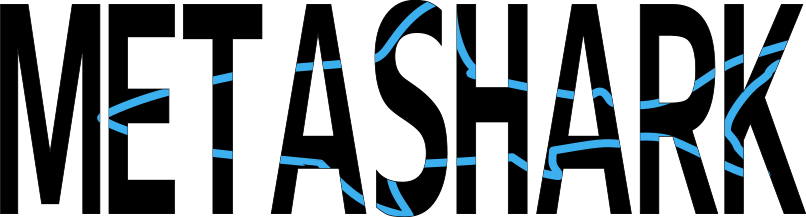

[](https://zenodo.org/badge/latestdoi/216049930)



**Stable Server address:** http://openstack-192-168-100-121.genouest.org/  `Active`  
**Dev Server address:** http://openstack-192-168-100-116.genouest.org/ `Active`  
<!-- `Active`  -->
<!--  `Maintenance` -->

Metadata Shiny-Automated Resources & Knowledge
_First released on 15-04-2019_  

The aim of the MetaShARK app is to allow any user a bit familiar with ecology to fill in data packages to provide as many information as possible on any dataset used in a publication, communication, etc. in ecology. The challenge of this work is to produce a user-friendly tool to a science community which is not familiar to heavy metadata standards and their informatic specification. Consequently, the choice has been made to work only with R as it is the currentest programming language in this community and it can be easily accessible as an open source application, despite of its low performances.
This project has the ambition to offer the user a user-friendly alternative to existing tools (such as the hardcore Morpho ;) ) but also to address an other issue which is the EML is not always fully considered.  
This MetaShARK git is called "v2" because it is the evolution with {golem} package of the previous [MetaShARK git](https://github.com/earnaud/MetaShARK)

MetaShARK has a dedicated [dockerhub](https://hub.docker.com/r/eliearnaud/metashark/dockerfile) and its deployment method is also [accessible](https://github.com/earnaud/MetaShARK_docker/).

**Any suggestion is welcome, feel free to contact the dev !**

## Installing MetaShARK

### Local installation

There are two versions of MetaShARK currently available:

* Stable : this version is the last version described in the *RELEASES.md* file.
* Dev : this version is the last version released, described later in this file. However, it might suffer some bugs.

**If you are using Dev version, reinstall it regularly !** The dev team will try to push needed fixes at least once per week during dev maintenance.

All dependencies are described in the DESCRIPTION file. You will also need to install the following system libraries, according to you OS:

| OS          | Debian-like          | Fedora, CentOS, RHEL | Solaris     | Mac OSX     |
|-------------|----------------------|----------------------|-------------|-------------|
| libcurl     | libcurl4-openssl-dev | libcurl-devel        | libcurl_dev | curl        |
| libxml-2.0  | libxml2-dev          | libxml2-devel        | libxml2_dev | libxml2     |
| openssl     | libssl-dev           | openssl-devel        | libssl_dev  | openssl@1.1 |
| libjq       | libjq-dev            | libjq-devel          | libjq_dev   | jq          |
| libv8       | libv8-dev            | v8-devel             | libv8_dev   | v8          |
| redland     | librdf0-dev          | redland-devel        | librdf_dev  | redland     |
| poppler-cpp | libpoppler-cpp-dev   | poppler-cpp-devel    | poppler_dev | poppler     |

You can install the app as follow (through command line, for Ubuntu):

```
apt -y update
apt -y upgrade 
apt install -y r-basehttps://placehold.it/15/FF0000/000000?text=+
apt install -y libcurl4-openssl-dev libssh2-1-dev libssl-dev libxml2-dev # libgit2-dev 
R -e 'install.packages("devtools")'
apt install -y libv8-dev
R -e 'devtools::install_github("EDIorg/EMLassemblyline", ref="fix_41")'
apt install -y  libjq-dev librdf0-dev 
apt-get install -y libpoppler-cpp-dev
R -e 'install.packages(c("shinyBS","shinycssloaders","readtext"))'
# Stable: 
R -e 'devtools::install_github("earnaud/MetaShARK-v2", dependencies=TRUE)'
# Dev:
R -e 'devtools::install_github("earnaud/MetaShARK-v2", ref="dev", dependencies=TRUE)'
```

### Dockerization

You can access docker files and setup at [this repository](https://github.com/earnaud/MetaShARK_docker).

## MetaShARK features

### Documentation

First feature developped in MetaShARK, it is possible to consult any documented part of the Ecological Metadata Language. This documentation directly relies on the EML 2.2.0, and some tags (as the "eml-\*" ones) can be undocumented. Also, it is possible to access the original documentation through the dedicated tab.

### Metadata filling

Two methods are being developped to fill in metadata:

* Metadata Fill-In (MetaFIN) : still not accessible, it is the PNDB specific tool exploring automatic inference to fill in metadata from datasets.
* EML Assembly Line (EMLAL) : it is the EDI tool allowing the user to interact with a major part of the EML. MetaShARK is a user front-end solution to offer more automated and visual access to this tool.

### Data Package upload

It is possibe to upload data packages to metacats registered in MetaShARK. You will need to fetch your metacat token in the corresponding MetaCatUI. 

### References

Some references are given that sustain the base principles of this work.

## Releases

### Pre-release 20200316 - Fully functional !

Here we are ! The full EML Assembly Line workflow has been done with MetaShARK. Even if the app might still suffer some bugs, the main steps are accessible. However, it stills only support tabulated file.

### Pre-Release 20200204 - EML Assembly Line (dev version)

Here it comes ! The first pre-release allowing the user to describe his dataset according to the [EML Assembly Line](https://ediorg.github.io/EMLassemblyline/articles/overview.html) recommendations. Please note this version is **still in development** and some features might suffer bugs. Consequently, do not hesitate to [open an issue](https://github.com/earnaud/MetaShARK-v2/issues).

#### Features

MetaShARK/EAL supports:
* data package management (CC BY or CC 0 Licences)
* tabulated files's description (and *only* those ones yet, badly)
* automated\* tables' attributes filling
* custom units' descriptions
* automated\* categorical variables description
* geographic, taxonomic\*\* and temporal coverages
* description of persons involved (possibly through ORCID)
* Metadata automated\* generation at EML format

\* automation still requires user's verification
\*\* see Known Bugs below

#### Known Bugs

* An EAL issue occurs: on the first time you try to write an EML file, you might have an error concerning "ns_lookup()". Re-trying to write EML then makes it.

## Authors
* Elie Arnaud (developper) - elie.arnaud@mnhn.fr

## Contribute
Any contribution can be done and submitted. To contribute, please refer the 'contributing.md' file.

## Submit issues
For anny issue submittance, please add a single-word tag in bracket before the title of your issue. Do not hesitate also to describe it exhaustively and add a label.
